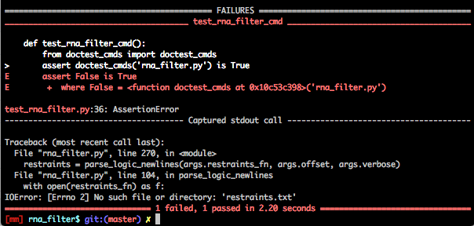
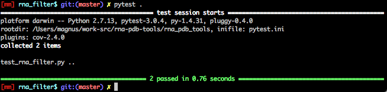

doctest-cmds
============================================================================

A proof of concept doctesting for cmds in Python doctests:



Usage with `pytest`:

```python
import doctest_cmds

def test_rna_filter_cmd():
    assert doctest_cmds.is_ok('rna_filter.py') is True
```

in `rna_filter.py`, test this cmd in the doctest:

```python
#!/usr/bin/env python

"""rna_filter.py - calculate distances based on given restrants on PDB files or SimRNA trajectories.

The format of restraints::

    (d:A1-A2 < 10.0 1) = if distance between A1 and A2 lower than 10.0, score it with 1

Usage::

    $ python rna_filter.py -r restraints.txt -s test_data/CG.pdb -v
    (d:A1-A2 <  10.0  1)|(d:A2-A1 <= 10 1)
    restraints [('A1', 'A2', '<', '10.0', '1'), ('A2', 'A1', '<=', '10', '1')]
```

**Caution**: this version is extremely raw, it searches for a line that starts with '  $ python ' in the code, so it might easily get false positive.
 It runs the cmds to see if there is an error. It does not compare outputs yet. A starting point for the further improvements.

Inspiration:

- https://github.com/JNRowe/shell-doctest

When OK:



Install
-------------------------------------------------------------------------------

    pip install git+git://github.com/mmagnus/doctest-cmds

TODO
-------------------------------------------------------------------------------

- [ ] check if there is something useful here https://pypi.python.org/pypi?%3Aaction=search&term=doctest&submit=search
- [ ] compare outputs
- [x] make a package
